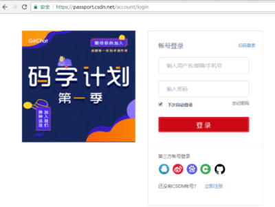
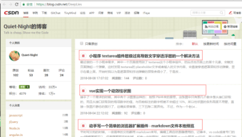
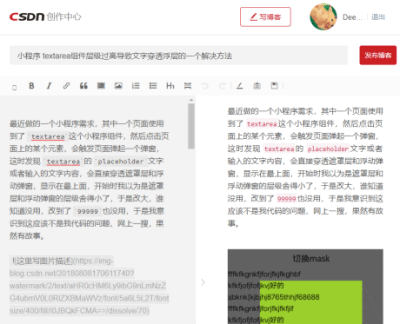
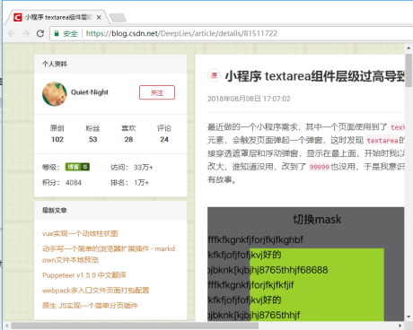
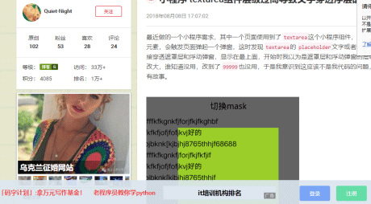
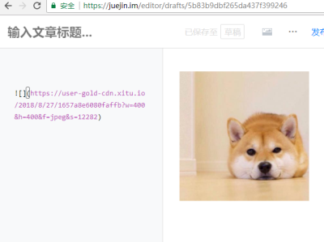

# 将自己在CSDN上的文章下载到本地并上传到掘金

`CSDN` 算是一个老牌技术网站了，很多喜欢写文章的人，一开始都是在 `CSDN`上发布，但是可能由于某些原因，有的人想把自己在 `CSDN`上的文章放到其他的网站上(嗯，比如掘金)，但是由于在 `CSDN`上发布的文章数量很多，一篇篇复制粘贴下来理论上是可行的，就是手酸了点。

不过，作为技术型<del>体力劳动者</del>人才，重复一种动作几十甚至上百遍未免有点丢失 `biger`，想起前段时间我花费了 **大量时间** 翻译的 [Puppeteer](https://juejin.im/post/5b362d6051882574b62a0b17)，至今还没体现出其价值来，于是决定就用它了。

>本文的可运行示例代码已经上传到 [github](https://github.com/accforgit/blog-data/tree/master/%E5%B0%86%E8%87%AA%E5%B7%B1%E5%9C%A8CSDN%E4%B8%8A%E7%9A%84%E6%96%87%E7%AB%A0%E4%B8%8B%E8%BD%BD%E5%88%B0%E6%9C%AC%E5%9C%B0%E5%B9%B6%E4%B8%8A%E4%BC%A0%E5%88%B0%E6%8E%98%E9%87%91)了，需要的请自取，顺手 `star`哦~

---

## 下载

想要获取到文章的标题和内容信息，第一个想到的就是文章的详情页，标题就一行，没那么多道道还好说，但是内容就要复杂点了，如果直接分析内容元素的 `DOM`结构当然可行，但未免有点麻烦，如果直接获取内容的字符串，例如使用 `textContent`这种方法，又会丢失语义，没办法获得内容的层级结构

不过我转念一想，既然这文章是自己的，那么完全可以进入文章的编辑页啊，编辑框内的内容不就是文章的原始内容吗，我写文章都是用 `md`编辑器，那么编辑框里的内容就是 `md`源文件，正是我想要的东西。


想要进入后台编辑页，必须要登录，于是先登录，`CSDN`的登录页链接是 `https://passport.csdn.net/account/login`，登录分为账号密码登录和第三方登录，就按最简单的来，所以我选择了账号密码登录，如果你之前一直是第三方登录，没有账号密码，那么你可以选择现在去创建一个，或者换一种写法，就用第三方登录，我这里演示账号密码登录的流程 <del>第三方登录你自己想办法</del>：

```js
await page.goto('https://passport.csdn.net/account/login', { timeout })
// 切换到账号密码登录
await page.click('.login-code__open')
await page.waitForSelector('#username')
await sleep()
// 在表单中输入 账号 密码
await page.type('#username', 'Your Name')
await page.type('#password', 'Your pwd')
// 登录
const loginBtn = await page.$('.logging')
// 点击登录按钮
await loginBtn.click()
await page.waitForNavigation()
console.log('csdn登录成功')
```

登录成功后，先别急着去编辑页，因为还没确定编辑页链接，先把你自己所有发布的文章详情页的链接拿到，就拿我自己来举栗吧。

每个人创作者都有这样一个页面，例如 [https://blog.csdn.net/DeepLies](https://blog.csdn.net/DeepLies)，这个页面罗列了你所有的文章：



在这个页面的最底部，有个可以翻页的区域：


从这里可以知道自己的文章共可以分为多少个翻页，同时也可以得到每个翻页的地址链接，例如，点击下面的页码 2，就会去往 [https://blog.csdn.net/DeepLies/article/list/2](https://blog.csdn.net/DeepLies/article/list/2)，这个链接前面部分是固定的，就叫它 `base url` 吧，只有最后那个数字会改变，这个数字就对应相应翻页的地址

```js
// 前往文章列表页 第 1 页，从第1页获取所有的翻页信息
  await page.goto('https://blog.csdn.net/DeepLies/article/list/1', { timeout })
  // 获取最底部的翻页区域，获取所有翻页页面
  await page.waitForSelector('#pageBox li')
  sleep()
  // 获取所有页码 li内的文本，作用是根据这些文本中的数字找到最大页码
  const pageNumLiText = await page.$$eval('#pageBox li', eles => Array.from(eles).map(ele=>ele.textContent))
  // 从获取到的页码中计算出最大页码，最大页码也就等于翻页的总页面数
  const maxPageNum = Math.max.apply(Math, pageNumLiText.reduce((total, d) => {
    if (!isNaN(Number(d))) return total.concat(+d)
    return total
  }, []))
  await browserManage.closeCtrlPage(page)

  // 翻页的 共同 url字符串
  const baseUrl = 'https://blog.csdn.net/DeepLies/article/list/'
  // listPage 暂存了所有的翻页链接
  let listPage = []
  for (let i = 1; i < maxPageNum + 1; i++) {
    listPage.push(baseUrl + i)
  }
```

于是，目前为止，我们可以拿到所有的翻页，然后每个翻页上有对应的文章列表，根据这个元素就可以得到文章的 `articleId`，每篇文章详情页和编辑页的 `base url`都是一样的，文章详情页（例如 `https://blog.csdn.net/DeepLies/article/details/81511722`）的）的 `base url`是 ` https://blog.csdn.net/DeepLies/article/details`，文章编辑页（例如 `https://mp.csdn.net/mdeditor/81511722`）的 `base url`是 `https://mp.csdn.net/mdeditor`，可见，只要拿到文章的 `id`，就能得到其详情页和编辑页的地址，遍历所有的翻页，就能得到所有的文章的 `articleId`：

```js
// 前往每一个翻页
await evPage.goto(url, { timeout })
await evPage.waitForSelector('.article-item-box')
// 获取到当前翻页的所有文章的id，这里是通过截取文章详情页的地址字段得到的 articleId
const pageDetailIds = await evPage.$$eval('.article-item-box h4 a', eles => eles.map(e => e.href.match(/\/(\d+)$/)[1]))
```



根据文章的 `articleId`得到文章的编辑页地址，就能进入编辑页直接从编辑框中获得文章 **md正文**，从标题框中获得文章的 **标题**。<del>完美结束</del>

不过，还有个问题，文章正文中除了一般的文字之外，还有图片链接，按理说，这个图片链接是网络链接，直接引用是没问题的，`but`，`CSDN` **不仅** 给图片加了水印，**而且** 还加了防盗链！

这是水印：


这是防盗链：


嗯，水印的事情我看了一圈，加上去容易但是弄下来就比较复杂了，可以搞但是不太好搞，不是本文主要探究的事情
至于防盗链就更狠了，我试了下，这不仅仅是加个 `Referer`或者带个 `Cookie`就能解决的事情
不过这都没关系，过程不重要，结果才是想要的，我不是要引用这个图片，我是要下载它，管它什么水印、防盗链，物理攻击一次性解决，绝招：截图大法

```js
// 对图片进行截图操作
await pageHandle.screenshot({ path: path.resolve(__dirname, `../article/${title}/${fileName}`), clip })
```

反正不管怎么说，这图片肯定是可以被看到的，既然可以被看到，那就可以被截图，`puppeteer` 提供的 `screenshot` 真乃搞定防盗链图片的利器也，以后大家有搞不定的防盗链图片，就把它截下来，当然，由于是截图，所以如果是 `gif`格式的动图，那就没办法了，你手动<del>滑稽</del>下载吧
至于水印，仔细看了下，根据`CSDN`给图片加水印的方法，其实只要把图片链接最后面 `?`后面所有的参数全部去掉，留下来的链接就是没有加水印的图片链接
例如正常文章中的图片链接是 `https://img-blog.csdn.net/20171220155632166?watermark/2/text/aHR0cDovL2Jsb2cuY3Nkbi5uZXQvRGVlcExpZXM=/font/5a6L5L2T/fontsize/400/fill/I0JBQkFCMA==/dissolve/70/gravity/SouthEast`，而这个图片的无水印版链接是 `https://img-blog.csdn.net/20171220155632166`，所以只需要将图片后面的参数全部去掉，显示在浏览器中的图片就是无水印版本的图片，然后再结合上面的截图，就 `get`了

这里需要注意的是，原先文章内的防盗链链接是用不了的，你把图片下载到本地后，要把文章中对应的图片链接换成本地的（当然，是用代码换），否则你下载下来后文不对图有什么意义

这里有几个坑需要注意一下

- 1号坑

如果你想使用文章原本的标题当做下载下来文章的文件名，那么有些含有特殊字符的标题要特殊对待一下，因为某些特殊字符，例如 `/:*?"<>|`，这些是不能作为文件名保存的，这不是代码的问题，是操作系统的问题，所以碰到这些字符就要额外处理一下：

```js
const clearFilePath = filePath => {
  // 我这里把特殊字符通通换成 !
  return filePath.replace(/[\/:*?"<>|]/g, '!')
}
```

- 2号坑

使用 `screenshot`方法截图的时候，如果有的文章图片一半在屏幕视野内，一半在屏幕视野外，就像这样：



则对这种图片进行截屏的时候，可能会出现把滚动条截进去的情况，最后截图是这样的：


这其实很好理解，用眼睛来看的话，图片本来就是被滚动条挡住的，截图的时候滚动自然就要被一同截进来，不过下面一半眼睛是看不到，为什么也能被截进来，甚至那些完全在视野外的也都能完整的进行截取？可能这种实现就是所谓的一半从实际情况一半从需求方面考虑了吧。

先别管为什么这么设计，但既然找到原因，解决即可，这里我采用的解决手段也很简单，既然有滚动条，那我把滚动条隐藏不就行了：

```js
document.body.style.overflow = 'hidden'
```
直接给 `body`设个 `overflow`的样式，这样就没有滚动条了，而且前面也说了，屏幕外的图片也可以被截取，被屏幕 `overflow:hidden`的元素也可以截取，所以不必担心图片也这个样式给 `hidden`掉了， <del>外国的东西就是好，人性化</del>

- 3号坑

上一条提到，使用 `screenshot`这个方法截图，大部分情况下截图的结果，和你手动开浏览器截图是一样的，那么如果有什么东西(没错，说的就是广告)挡在了你所要截图的图片上面，那毫无疑问也会被截取下来，所以需要将广告屏蔽掉，最简单的方式就是 `display: none`



目前这个时间点，在我目前这个电脑上，只有一条广告影响到了截图，我就直接把它 `display: none`掉了，但是广告这种东西变化莫测，说不定哪天就换了一个位置换了一个形式，那就需要使用者自行寻找并 `display: none`之了。

## 上传

通过前面的步骤，就可以将 `CSDN`上的文章下载到本地了，不过我还想给弄到掘金上，因为我总觉得前端的文章在掘金上曝光量更大，上传这一步我决定换个方法，上面使用 `puppeteer`用得太累了，想要调接口直接把文章传上去，然而，我发现掘金并不打算给我找个机会：想要使用上传接口不仅仅需要带 `cookie`，还需要带 `token` <del>什么仇什么怨</del>

`cookie`好解决，但是 `token`这个东西不好弄，我深深地思考了下，考虑到前面用 `puppeteer`差不多也熟手了，还是继续用下去吧 <del>puppeteer 真香</del>

首先，还是老规矩，想上传肯定是要登录的，掘金登录也分账号密码和第三方登录两种，这里还是用最简单的账号密码登录

```js
await page.goto('https://juejin.im/', { timeout })
// 点击 .login元素，把登录弹窗弄出来
await page.click('.login')
await page.waitForSelector('.auth-form')
await sleep()
// 输入账号密码
await page.type('input[name=loginPhoneOrEmail]', 'Your Name')
await page.type('input[name=loginPassword]', 'Your pwd')
const loginBtn = await page.$('.auth-form .btn')
// 点击 登录 按钮
await loginBtn.click()
await page.waitForNavigation()
console.log('掘金登录成功')
```

读取需要上传的文章，有两种方法，一种是等前面下载完了，再读取本地文件进行上传；另外一种就是一边下载一边上传，直接利用下载时获取的文章信息即可，这样就少了读取本地文件这一步，这里采用后一种

这一步的难点在于，要从正文中获取到所有的图片链接（因为下载到本地了，所以这里就是图片的本地路径），并把图片链接对应的本地图片文件进行上传，然后再获取到对应上传后的网络路径，替换掉本地图片路径，就组成了一篇可以直接上传的正文

由于不清楚一篇文章中到底有多少的图片，也不清楚这些图片都放在什么地方，所以需要全文检索，这里采用的手段如下：

- 将文章正文当做是一个长字符串，将正文中的每个图片链接（例如 ``）都当做是这个长字符串的分隔符，这样正文就被图片链接分割成了 `n`份
- 根据上一步，将图片链接和剩下的正文分开，分别存储到两个变量中，例如 `var contentArr = [content1, content2, content3...]`，`var imgArr = [pic1, pic2...]`，这里把图片链接当做是正文的分隔符，所以正文数组的长度肯定是比图片数组长度大 `1`的。
  ```js
  const contentArr = content.split(/!\[.*?\]\(.*?\)/)
  const imgArr = []
  content.replace(/!\[.*?\]\((.+?)\)/g, (m1, m2) => imgArr.push(m2))
  ```
- 上传 `imgArr`中的数据项，这些数据项目前都是本地图片路径，上传后即可在掘金的编辑框内得到相应的网络路径，得到图片网络地址的数组 `imgJuejinUrlArr`
  ```js
  const relativePath = `article/${articleTitle}/${fileBaseName}`
  const uploadInput = await page.$('.image-file-selector', { hidden: true })
  // 遮罩层出现，说明开始上传
  await uploadInput.uploadFile(relativePath)
  ```
  
- 按照顺序依次拼接 `contentArr` 与 `imgJuejinUrlArr` 内的数据项，得到上传正文
  ```js
  const juejinContent = contentArr.reduce((t, c, i) => {
    return t.concat(c, imgJuejinUrlArr[i] || '')
  }, []).join('')
  ```
- 上传文章

原理就是上面那样，代码可能稍微有些复杂，需要调试的时间可能会有点长

## 总结

当我准备用代码实现本文功能的时候，我觉得或许有点复杂，一时半会应该不太能搞定，怎么也得两三天的时间吧
但是实在是没想到，棘手程度远超预期，利用周末和下班后那点时间，断断续续一直搞了一个多星期才最终搞定，
由于对 `puppeteer`不是很熟，掉了很多坑，又因为开始时没预料到这个功能那么复杂，所以对代码结构没什么规划，
直到写到一半才不得不把代码重构了一遍，另外，由于此功能时调用浏览器模拟对网站的实际操作，
还需要考虑到网速、超时、占用资源等实际因素，都要一一解决。
本意是想解放劳动力，优雅而快速地搞定实际需求，谁知写代码花费的时间完全足以我手工人肉把我在 `csdn`上的文章下载下来并上传到掘金好几遍了！<del>天杀的</del>

>另外，**目前这个时间点**，此项目可正常运行，但是爬虫(姑且认为我写的是一个爬虫吧)这个东西，特别是本文项目这种与网页元素结构紧密联系的爬虫，可能只是因为目标页面换了个元素结构、换了个类名、换了个展示逻辑、换了个接口……就不能用了，所以如果碰到这种问题，请自行解决一下，大体处理逻辑是不变的，修正这种小问题就很简单了。

---